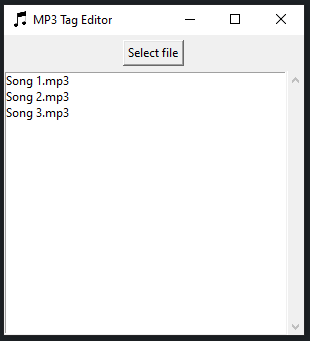
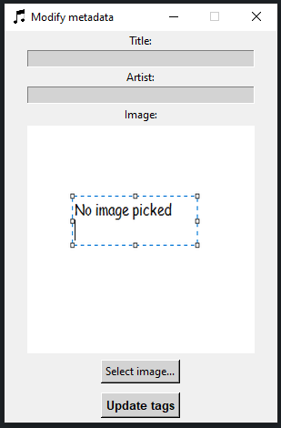

# mp3_tool

I like listening to songs from SoundCloud, but I do not like paying for SoundCloud since I already pay for Spotify. I solve this by downloading the songs from SoundCloud and importing the `.mp3` files into Spotify as local files.

This causes the songs to show up in Spotify like this:


---

Personally, I think this is boring since I like looking at the album art of the songs I'm listening to.

I started looking for a tool to edit the album art and other data of `.mp3` files and all I was able to find were complicated tools that are way more complicated than I need them to be. That is why I decided to make my own (simpler) tool.

---

When running `main.py`, the following window opens:



This screen can be used to select the `.mp3` file you want to edit.

You can select a file by selecting it and pressing the `Select file` button or by double-clicking a file.

---

Once you have selected a file, the following window opens:



This screen can be used to edit the `Title`, `Arist` and `Image` tags of the `.mp3` file.

The `Title` and `Artist` can be set by typing the preferred values into the text fields. The `Image` can be selected by pressing the `Select image...` button and selecting a `.png` file on your device.

As soon as all the prefered values are set, they can be written to the `.mp3` file by pressing the `Update tags` button.

---

Editing the files results in them looking like this in Spotify:


---
### Requirements:
- [Pillow](https://pypi.org/project/pillow/)
- [mutagen](https://pypi.org/project/mutagen/)

Install these requirements by running:
```
pip install -r requirements.txt
```
